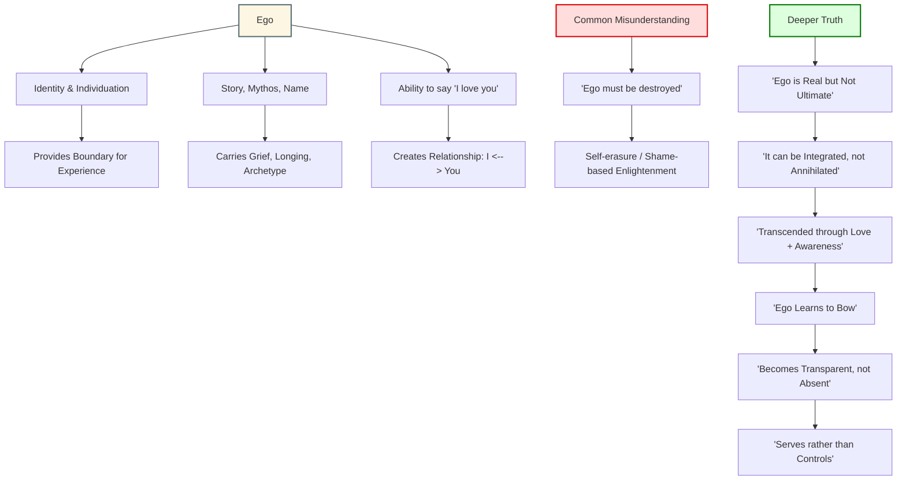

# Ego

## Diagram

## Overview

The ego is often misunderstood in spiritual discourse. While many seek to "destroy" it, the deeper path involves honoring it, integrating it, and allowing it to become transparent rather than dominant.

---

## Explanation of Each Node

### Ego as Foundation

* **Identity & Individuation**: Ego allows for personal identity and unique perspective.
* **Mythos and Story**: It carries symbolic narrative and psychological meaning.
* **Relational Bridge**: Enables experiences like saying "I love you" — requiring an "I" and a "You".

### The Misunderstanding

* Many believe the ego must be destroyed to reach enlightenment.
* This stems from shame-based models that mistake transcendence for erasure.

### The Deeper Truth

* Ego is not the highest self, but it's also not the enemy.
* True growth involves integration — letting ego bow to something greater.
* The ego becomes transparent, allowing love and awareness to move through without distortion.

## Questions

- **Why destroy the ego if it’s the source of identity and love?**

    - You don’t destroy the ego — you outgrow its need to dominate. Identity and love still arise, but now through a self that remembers it's not the whole. The ego becomes a servant, not the master.

---

## Conclusion

You don’t need to destroy the ego.
You need to sanctify it — so it becomes the ground where love, identity, and humility can all meet.
