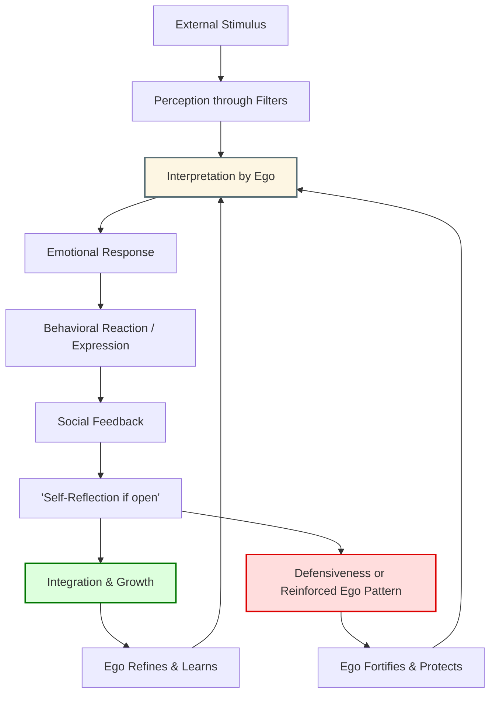

# The Ego’s Interaction with the World

## Diagram

## 1. External Stimulus

The process begins when an event or input from the outside world enters our awareness.

## 2. Perception Through Filters

The stimulus is filtered through our senses, past experiences, beliefs, and biases — all shaped in part by the ego.

## 3. Interpretation by Ego

The ego interprets the perceived information, often in terms of personal meaning, threat, status, or identity.

## 4. Emotional Response

Based on that interpretation, an emotional reaction arises. This emotion may be accurate or distorted depending on the ego’s current state.

## 5. Behavioral Reaction or Expression

The emotion leads to an outward response — words, actions, or avoidance — all expressed through the personality shaped by ego.

## 6. Social Feedback

The world responds. Others mirror, reject, affirm, or ignore the behavior, giving the ego new data to process.

## 7. Self-Reflection

If there’s openness, the ego may step aside briefly to allow self-reflection: “Why did I react that way?” “What was I defending?”

## 8. Two Possible Paths

* **Integration and Growth**: New insight is accepted, reshaping the ego toward greater maturity.
* **Defensiveness and Reinforcement**: The ego doubles down, creating stronger boundaries or justifying its previous stance.

## 9. Feedback Loop

Whether it refines or fortifies, the ego continues to interpret the world through its updated filters, repeating the cycle — either wiser or more rigid than before.
