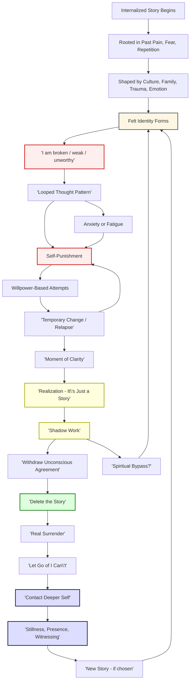

# Deconstructing the Inner Story: From Loop to Liberation

## Overview

You don’t need more willpower — you need less self-punishment.

This is a map of how internal narratives form, how they shape your identity, and how surrender leads not to defeat, but to freedom. The "story" you tell yourself isn't reality — it's a psychological loop constructed from memory, meaning, and repetition.

---

## Diagram

### Notes:

* **Red nodes** = Ego traps, pain loops, inner critic
* **Yellow nodes** = Breakthrough insight moments
* **Green/blue nodes** = Peace, awareness, clarity
* Arrows circle back to reflect *recurrence* and the *nonlinear nature* of growth
* Optional **Spiritual Bypass** fork warns of skipping the real inner work

---

## The Flow of the Inner Story

### 1. A Story Takes Root

It begins quietly — a belief, a fear, a moment of pain — woven from early wounds and the mind’s need to make sense of chaos.

### 2. Shaped by Life

Family dynamics, culture, trauma, and unmet emotions feed the story until it becomes familiar — not just in thought, but in the body.

### 3. Identity Crystallizes

The story becomes *you*: "I am broken." "I’m not enough." It’s no longer a thought — it’s a felt identity, stitched from repetition.

### 4. The Loop Takes Over

The mind replays the same narration. The more you try to fight it with willpower, the more it reinforces itself.

---

## The Turning Point

Eventually, something cracks — and you see the truth:
It’s just a story. Not law. Not you.

This is surrender — not giving up on life, but giving up on the belief that you're fundamentally unworthy of peace.

---

## The Exit Path

1. **Shadow Work** – Feel what you’ve avoided. Let it surface. Let it speak.
2. **Withdraw Agreement** – Stop feeding the loop by treating it as truth.
3. **Delete the Story** – Release the narrative. Its power depends on your belief.
4. **Stay Without Armor** – Let go of the image you defend. Just be here.
5. **Return to the Deeper Self** – The presence underneath the pattern — still, unshaken, alive.

---

## Final Insight

You don’t need to become someone new.
You need to stop pretending you're still the old story.

Let go — and meet what’s always been waiting underneath.

